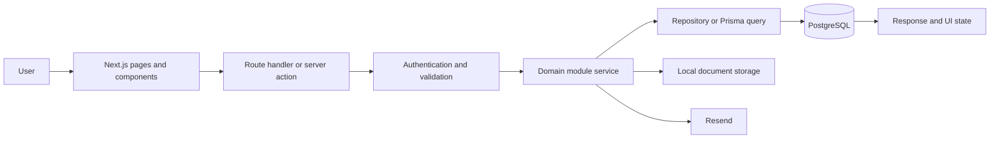
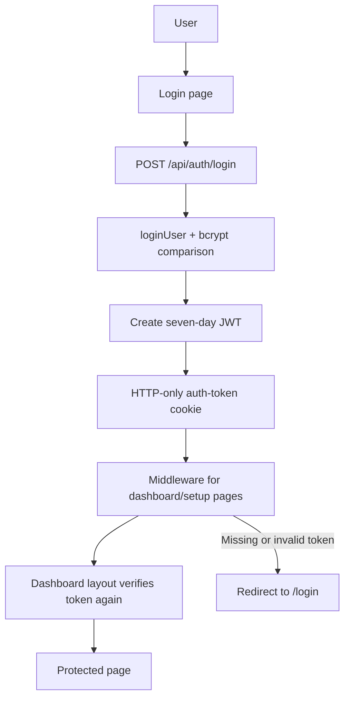
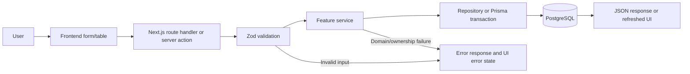
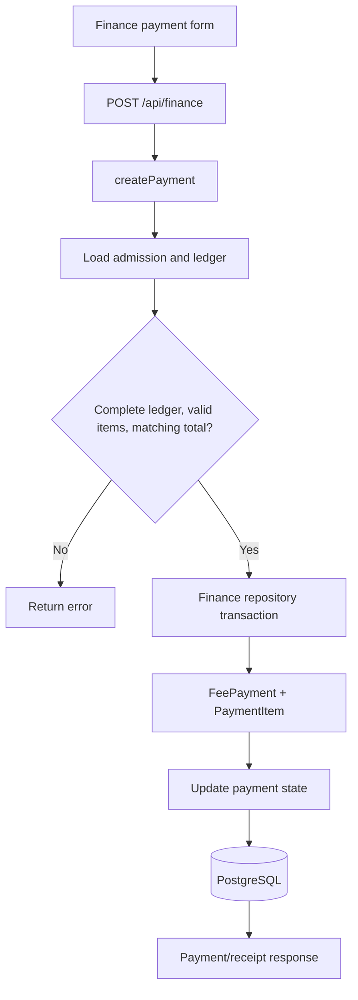
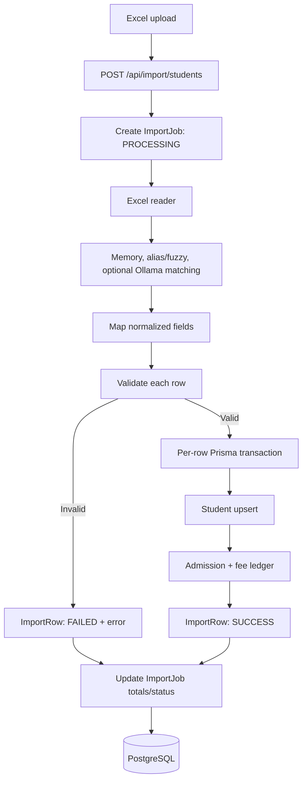
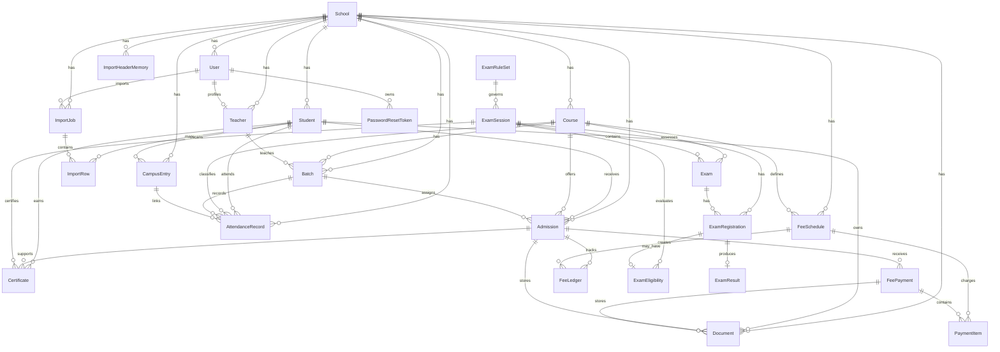

# 1. Architecture

ERP-Prototype is a full-stack **Next.js App Router** application. The repository contains the web UI, API route handlers, business modules, and database integration in `frontend/`; a separate backend service is **Not found in codebase**.

| Layer | Implementation | Code location |
|---|---|---|
| Runtime and UI | Next.js `16.2.4`, React `19.2.4`, TypeScript, Tailwind CSS 4 | `frontend/src/app/`, `frontend/src/components/` |
| Client state and forms | TanStack Query, TanStack Table, React Hook Form | `frontend/src/providers/`, `frontend/src/hooks/` |
| API and application logic | Next.js route handlers, server actions, module services/repositories | `frontend/src/app/api/`, `frontend/src/modules/` |
| Validation | Zod schemas and feature-specific validators | `frontend/src/modules/**` |
| Persistence | PostgreSQL, Prisma `7.8.0`, `@prisma/adapter-pg` | `frontend/prisma/schema.prisma`, `frontend/src/lib/prisma.ts` |
| Authentication | `jose` HS256 JWT, `bcrypt`/`bcryptjs`, HTTP-only `auth-token` cookie | `frontend/src/modules/auth/`, `frontend/src/middleware.ts` |
| Integrations | ExcelJS/XLSX, optional Ollama matching, Resend, local file storage, Sharp | `frontend/src/modules/import/`, `frontend/src/modules/mail/`, `frontend/src/lib/storage/` |

The normal server request path is:



Configuration is provided through `DATABASE_URL`, `JWT_SECRET`, and storage/import integration settings. Prisma is accessed through the singleton in `frontend/src/lib/prisma.ts`. No direct browser-to-Prisma access is present. `frontend/package.json` provides `dev`, `build`, `start`, and `lint` scripts; no test script is defined.

# 2. Modules

| Module | Purpose | Primary implementation |
|---|---|---|
| Authentication and setup | Login, JWT sessions, password recovery, first-time initialization | `modules/auth/`, `modules/setup/`, `app/api/auth/`, `app/api/setup/` |
| Students and admissions | Student records, admissions, registration numbers, barcodes, fee-ledger creation | `modules/student/`, `modules/admission/` |
| Courses, batches, and teachers | Course catalog, batch scheduling/assignment, teacher profiles | `modules/courses/`, `modules/batch/`, `modules/teacher/` |
| Attendance | Classroom attendance, campus scans, history, summaries | `modules/attendance/` |
| Finance and fees | Fee schedules, ledgers, payments, receipts, finance dashboard | `modules/finance/`, `modules/fee/` |
| Examinations | Rules, sessions, exams, registrations, results, eligibility, graduation, certificates | `modules/exams/` |
| Student import | Excel parsing, mapping, validation, header memory, AI matching, persistence | `modules/import/` |
| Documents and storage | Document metadata and local file lifecycle | `modules/document/`, `lib/storage/` |
| Dashboard and reports | Overview metrics, notices, charts, academic reports | `modules/dashboard/`, `modules/notice/`, `modules/reports/` |
| Administration | User management and examination-rule assistant | `modules/users/`, `app/api/users/`, `app/api/admin/rules/ai/` |

# 3. Sub Modules

| Module | Sub-modules and implemented features |
|---|---|
| Authentication and setup | Password hashing, JWT creation/verification, current-user lookup, admin helpers, login/logout, OTP verification, password reset, school/admin initialization |
| Students and admissions | Student list/search/detail, create/update/delete, bulk delete, admission create/update/delete/search, registration-number generation, barcode generation, completion-date calculation, fee-ledger repair |
| Courses, batches, and teachers | Course CRUD and bulk delete; batch CRUD/restore; teacher list and create/update/delete; course/batch/teacher schemas and types |
| Attendance | Attendance repository, manual attendance, class attendance, campus-entry scan/history, daily rosters, student history, dashboard summaries, theory/practical sections |
| Finance and fees | Finance service/repository/server adapter, payment CRUD, payment history, receipt retrieval, dashboard queries, fee queries/actions/schema compatibility layer |
| Examinations | Rule sets and AI assistant, sessions, exams, registrations, results, publish/unpublish, deterministic eligibility engine, graduation, certificates |
| Student import | Excel reader, value/date parsers, header detector/normalizer, alias/fuzzy matching, persistent header memory, mapper, validator, importer, student import service, optional Ollama adapter |
| Documents and storage | Document schema/service/actions; storage paths, upload, preview, download, delete, compression |
| Dashboard and reports | Dashboard queries/service, academic reports, notices, revenue/attendance/payment charts, recent payments |
| Shared UI | Dashboard shell, data tables, student/admission/course/batch/attendance/finance components, UI primitives, React Query/theme/toast providers, reusable hooks |

Classes/sections as separate database entities are **Not found in codebase**; the implemented academic grouping is represented by `Course`, `Batch`, `Admission`, and attendance records.

# 4. Functions

## Authentication and Setup

| Function or route | Implemented behavior |
|---|---|
| `loginUser()` | Finds an active user, compares the bcrypt password, and creates a JWT containing `userId`, `schoolId`, and `role`. |
| `POST /api/auth/login` | Validates credentials and sets the `auth-token` cookie. |
| `POST /api/auth/logout` and `GET /api/auth/me` | Clears the session and returns the current authenticated user. |
| `POST /api/auth/forgot-password`, `/verify-otp`, `/reset-password` | Creates/verifies reset OTP state and changes the password. |
| `GET /api/setup/status`, `POST /api/setup` | Checks initialization and creates or reuses a school plus administrator through setup service logic. |

## Students, Admissions, Courses, Batches, and Teachers

| Function or route | Implemented behavior |
|---|---|
| `getStudents()`, `getStudentById()` | School-scoped, paginated/searchable student reads with current admission/payment context. |
| `createStudent()` | Validates an active course and creates a student, admission, and fee ledger in a Prisma transaction. |
| Student actions | `create-student`, `update-student`, `delete-student`, and `delete-many-students` implement student mutations. |
| Admission actions/service | Create/update/delete admissions, generate barcodes and completion dates, build expected fee ledgers, and repair missing ledger entries. |
| `GET /api/students`, `POST /api/students` | Student list and create endpoints. Admission CRUD HTTP routes are **Not found in codebase**; admission mutations use module actions. |
| `GET /api/admissions/search` | Admission lookup for selection workflows. |
| Course, batch, and teacher actions | Validate ownership/active state and create, update, delete, restore, or list academic records. |
| `GET /api/courses`, `GET/POST/PUT /api/batches`, `GET /api/teachers` | Course, batch, and teacher API reads/mutations. |

## Attendance

| Function or route | Implemented behavior |
|---|---|
| `attendanceService.getAttendance()` and `getStudentHistory()` | Parse filters and read attendance through `attendance.repository`. |
| `getDailyAttendance()`, `getBatchStudents()`, `getSummary()` | Read daily batch rosters, student history, and filtered summaries. |
| `markManualAttendance()` and `markClassAttendance()` | Validate a non-empty record set and persist records with `MANUAL` or `CLASS` source. |
| `registerCampusEntry()` | Finds a student by registration number, rejects a recent duplicate scan, and creates `CampusEntry`; it does not create classroom attendance. |
| `GET/POST /api/attendance`, `GET /api/attendance/students`, `GET /api/attendance/summary` | Attendance listing, marking, roster, and summary endpoints. |

## Finance and Fees

| Function or route | Implemented behavior |
|---|---|
| `createPayment()` | Confirms the admission ledger is complete, validates selected fee items belong to the admission, and verifies selected amounts equal `amountPaid` before persistence. |
| `getFeePayments()`, `getPaymentById()`, `updateFeePayment()`, `deleteFeePayment()` | School-scoped payment list, detail, update, and delete operations. |
| `getPaymentHistory()` and `getPaymentReceipt()` | Read admission payment history and receipt data. |
| `GET/POST /api/finance` | List and create payments. |
| `GET/PUT/DELETE /api/finance/[paymentId]` | Payment detail, update, and deletion. |
| `GET /api/finance/payments/history/[admissionId]`, `/api/finance/[paymentId]/receipt`, `/api/finance/dashboard` | Payment history, receipt, and finance dashboard data. |

## Examinations

| Function or route | Implemented behavior |
|---|---|
| Rule/session/exam services | Manage JSON rule sets, sessions, theory/practical exams, and lifecycle state. |
| Registration service | Creates and reads/updates student exam registrations. |
| Result service | Validates marks and calculates percentage, grade, grade point, and result status. |
| `examEligibilityService.evaluate()` | Combines payment completion, supplied attendance results, theory results, practical results, and the session rule set; persists a versioned JSON eligibility snapshot. |
| Graduation and certificate services | Read graduation state and create/read certificate records. |
| `/api/exams/*` | Implements rules, sessions, exams, registrations, results, publish/unpublish, eligibility, graduation, and certificate endpoints. Exact route handlers are under `frontend/src/app/api/exams/`. |

## Student Import

| Function or route | Implemented behavior |
|---|---|
| `POST /api/import/students` | Accepts an Excel file, creates an `ImportJob`, builds a preview, validates rows, persists valid rows transactionally, and records `ImportRow` success/failure results. |
| `buildImportPreview()` | Reads workbooks, detects and normalizes headers, maps fields, and validates row data. Matching uses school-specific memory, aliases/fuzzy detection, and optional Ollama AI. |
| `importStudents()` | Upserts students by `(schoolId, registrationNumber)`, creates admissions and fee ledgers, creates unknown courses when required, rejects duplicate course admissions, and returns row errors. Imported payment values are not converted into payments. |

## Documents, Dashboard, Reports, and Administration

| Function or route | Implemented behavior |
|---|---|
| Document service/actions and `lib/storage/*` | Persist document metadata and manage local uploads, paths, previews, downloads, deletion, and compression. |
| `GET /api/dashboard/overview` | Returns dashboard overview data. |
| Academic report service | Supplies implemented academic report data. Other report categories are **Not found in codebase**. |
| `GET/POST /api/users`, `PATCH/DELETE /api/users/[id]` | User list/create/update/delete operations. |
| `POST /api/admin/rules/ai` | Runs the implemented examination-rule assistant endpoint. |

# 5. Supporting Functions

| Area | Implemented support |
|---|---|
| Database | `frontend/src/lib/prisma.ts` loads `DATABASE_URL`, creates `PrismaClient` with `PrismaPg`, and reuses the client outside production. |
| Identifiers | `generate-registration-number.ts` generates school/year/sequential registration numbers; `generate-employee-code.ts` generates employee codes; `barcode.ts` generates admission barcodes. |
| Fee logic | `buildFeeLedger()`, `generateFeeLedger()`, and `getMissingFeeLedgerEntries()` derive admission-specific ledgers from active course fee schedules. |
| Validation | Zod schemas cover auth, students, admissions, courses, batches, attendance, finance, exams, imports, documents, and setup. |
| Authentication | `jwt.ts` signs/verifies HS256 tokens with a seven-day expiry; `password.ts` hashes/compares passwords; `current-user.ts` verifies token plus active database user where used. |
| Middleware | `middleware.ts` redirects missing/invalid tokens for `/dashboard/:path*` and `/setup`; the dashboard layout repeats server-side token verification. |
| Authorization | JWTs carry `schoolId` and `role` (`ADMIN` or `STAFF`). Role enforcement is not uniform across all API handlers; broader authorization is **Not found in codebase**. Examination eligibility currently has no visible authentication check in its route handler. |
| Attendance persistence | `attendance.repository.ts` handles filters, daily records, summaries, classroom writes, campus entries, and recent duplicate-scan checks. |
| Finance persistence | `finance.repository.ts` handles payment context, payment CRUD, payment history, receipts, and dashboard data. |
| Import support | ExcelJS/XLSX parsing, date/value normalization, header memory in `ImportHeaderMemory`, field mapping, row validation, confidence handling, and optional Ollama integration. |
| File storage | `lib/storage/` manages configurable local paths, MIME/extension metadata, upload, preview, download, delete, and compression. Cloud object storage is **Not found in codebase**. |
| Shared components | `components/ui/` provides reusable controls; feature components cover students, finance, attendance, courses, batches, admissions, dashboards, and data tables. |
| Shared client services | React Query provider, theme/toast providers, and hooks for finance, payments, courses, batches, admissions, certificates, mobile state, and exams. |
| Error handling | Services throw domain errors; route handlers return `NextResponse` errors; selected pages provide `loading.tsx`/`error.tsx`; UI surfaces errors through toast/state components. A single global API error contract is **Not found in codebase**. |

# 6. Flow

## Authentication and Protected Pages



API authentication is route-specific rather than globally enforced. The setup API uses initialization checks, and the examination eligibility route currently does not show an authentication check; these are implementation caveats, not intended guarantees.

## CRUD Request



## Finance Payment



Payment update/delete paths are implemented, but corresponding fee-ledger reversal behavior is not consistently visible in the codebase and is not documented as guaranteed reconciliation.

## Student Import



## Attendance and Examination Flows

Manual/class attendance follows `route handler -> Zod schema -> attendanceService -> attendance.repository -> AttendanceRecord`. Campus scans resolve a school-scoped student by registration number, suppress scans inside the recent duplicate window, and write `CampusEntry` without creating classroom attendance.

Examination eligibility follows `session/rule lookup -> active admissions and fee ledgers -> exam registrations/results -> supplied course attendance -> eligibility.engine -> ExamEligibility snapshot`. Results are calculated server-side, and the persisted snapshot includes the rule version and evaluation JSON.

# 7. ER Diagram

The diagram below includes only relations declared in `frontend/prisma/schema.prisma`. Scalar IDs without Prisma relation declarations, including several examination `studentId`, `admissionId`, `ruleSetId`, and certificate `paymentId` fields, are intentionally not drawn as relationships.



# 8. Schematic Diagram (Summary)

```mermaid
flowchart LR
    USER[User] --> BROWSER[Browser]
    BROWSER --> NEXT[Next.js App Router]
    NEXT --> PAGES[Pages and reusable components]
    NEXT --> ROUTES[API route handlers]
    PAGES --> ACTIONS[Hooks and server actions]
    ROUTES --> MODULES[Domain modules]
    ACTIONS --> MODULES
    MODULES --> VALIDATION[Zod validation and business rules]
    MODULES --> PRISMA[Prisma client]
    PRISMA --> DB[(PostgreSQL)]
    MODULES --> EXT[Ollama | Resend | local storage]
```
