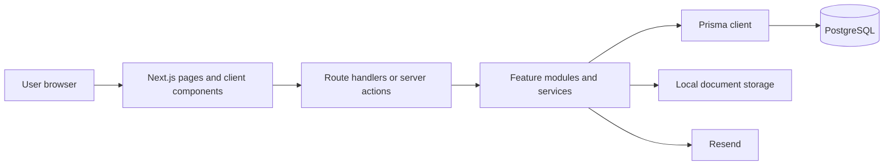
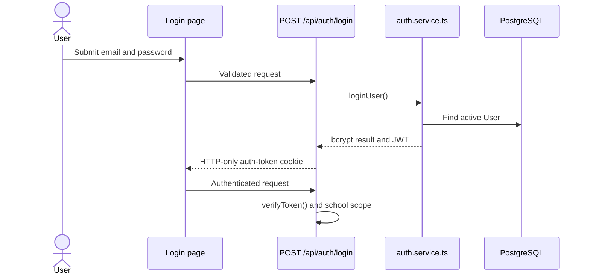
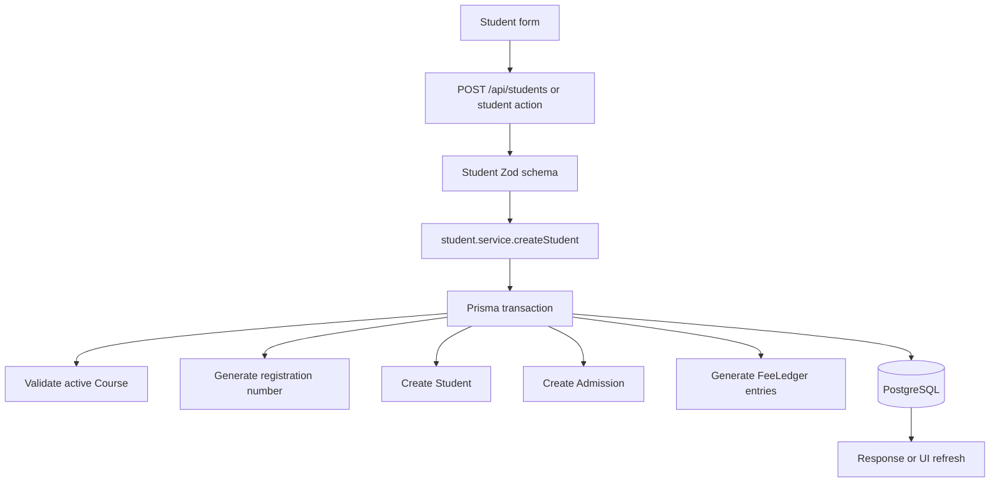
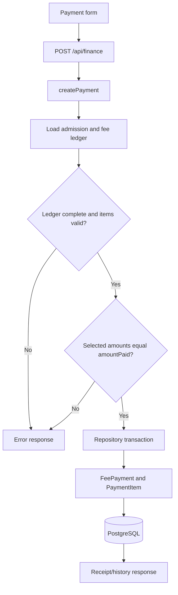
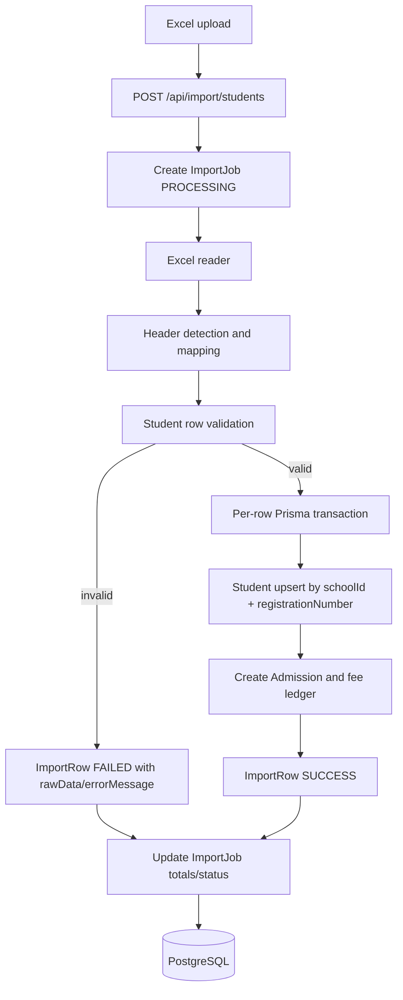
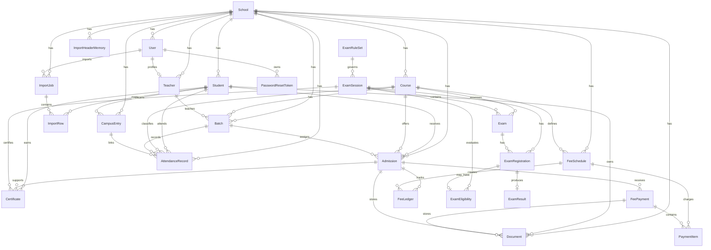
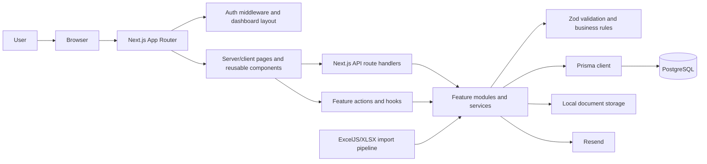

# System Architecture

ERP-Prototype is a full-stack Next.js application. The repository contains one deployable application rather than a separate frontend and backend.

| Layer | Implementation | Source |
|---|---|---|
| Web application | Next.js 16 App Router, React 19, TypeScript | `frontend/src/app/` |
| UI | Tailwind CSS 4, shadcn-style/Radix primitives, Ant Design, Lucide | `frontend/src/components/`, `frontend/src/app/globals.css` |
| Client data | TanStack Query and TanStack Table | `frontend/src/providers/react-query-provider.tsx`, `frontend/src/hooks/` |
| Validation/forms | Zod and React Hook Form | `frontend/src/modules/*/*.schema.ts`, components |
| Server/API | Next.js route handlers and server-side feature services | `frontend/src/app/api/`, `frontend/src/modules/` |
| Persistence | PostgreSQL through Prisma 7 and `@prisma/adapter-pg` | `frontend/prisma/schema.prisma`, `frontend/src/lib/prisma.ts` |
| Authentication | `jose` JWT, `bcrypt`, HTTP-only `auth-token` cookie | `frontend/src/modules/auth/`, `frontend/src/middleware.ts` |
| Files and mail | Local document storage; Resend mail integration | `frontend/src/lib/storage/`, `frontend/src/modules/mail/resend.ts` |
| Import and reporting | ExcelJS/XLSX, Fuse.js, optional Ollama import matching, Recharts | `frontend/src/modules/import/`, `frontend/src/modules/reports/`, components |

The request path is generally:

Server components, route handlers, and services access Prisma through the singleton in `frontend/src/lib/prisma.ts`. Client components and hooks call HTTP endpoints; direct browser-to-Prisma access is not present in the codebase. `frontend/next.config.ts` enables the React compiler. The package scripts are `dev`, `build`, `start`, and `lint`; no test script is defined in `frontend/package.json`.

# Modules

| Module | Responsibility |
|---|---|
| Auth and setup | Login, signup/setup, current user, logout, OTP password recovery, JWT sessions |
| Students and admissions | Student records, admissions, registration numbers, barcodes, completion dates, fee-ledger creation |
| Courses, batches, and teachers | Academic catalog, batch assignment, teacher profiles and actions |
| Attendance | Manual/class attendance, campus scans, history, summaries, theory/practical sections |
| Finance and fees | Fee schedules, ledgers, payments, payment history, receipts, finance dashboard |
| Examinations | Rule sets, sessions, exams, registrations, results, eligibility, graduation, certificates |
| Imports | Excel student import, mapping, validation, AI/header matching, import jobs and row errors |
| Documents | Document metadata and local file upload, preview, download, deletion, compression |
| Dashboard and reports | Overview statistics, notices, academic reports, charts |
| Administration | User management, roles/status, admin examination-rule assistant |

The `class`, `report`, `notice`, and legacy `fee` module directories also exist. Their implemented surfaces are listed below; broader functionality is **Not found in codebase** where no corresponding service or route was found.

# Sub Modules

| Module | Implemented sub-modules/features |
|---|---|
| Auth and setup | `auth.service`, JWT/password helpers, current-user lookup, admin guard helpers, setup initialization, forgot-password/OTP/reset |
| Students and admissions | Student CRUD and bulk deletion; admission create/update/delete/search; generated registration numbers and admission barcodes; fee-ledger repair |
| Courses, batches, and teachers | Course create/update/delete/bulk delete; batch create/update/delete/restore; teacher list and create/update/delete |
| Attendance | Attendance list/history, daily batch attendance, manual attendance, class attendance, campus-entry scan/history, summaries |
| Finance and fees | Payment CRUD, payment history, receipt retrieval, finance dashboard, fee service/query/action compatibility layer |
| Examinations | Rule CRUD and AI assistant; session CRUD; exam CRUD; registration CRUD; result creation/read and publish/unpublish; eligibility engine; graduation; certificates |
| Imports | Excel reader/value/date parsers, header detector/normalizer, mapper, validator, importer, student import service, header memory, optional AI/Ollama matcher |
| Documents | Document types/service/actions and local storage adapters |
| Dashboard and reports | Dashboard overview queries/service; academic report service; notice queries/actions/service; dashboard charts and notice board |
| Administration | User list/create/update/delete; role/status UI; profile/settings pages |
| Shared UI | Generic data tables, finance/student/admission/course/batch/attendance components, dashboard shell, UI primitives, theme/toast/React Query providers |

Implemented route groups include `(auth)` for login, signup, setup, forgot-password, reset-password, and OTP verification; `(dashboard)` for overview, people, academics, finance, examinations, administration, reports, profile, and settings; and `api` for the handlers below. A separate backend service is **Not found in codebase**.

# Functions

## Authentication and Setup

| Function/API | Behavior |
|---|---|
| `loginUser()` in `modules/auth/auth.service.ts` | Looks up an active user, compares the bcrypt password, and creates a JWT containing `userId`, `schoolId`, and `role`. |
| `POST /api/auth/login` | Validates login input and sets the `auth-token` cookie on success. |
| `POST /api/auth/logout`, `GET /api/auth/me` | Clears the session cookie and returns the current authenticated user respectively. |
| `POST /api/auth/forgot-password`, `/verify-otp`, `/reset-password` | Creates/verifies password-reset OTP state and updates the password. |
| `GET /api/setup/status`, `POST /api/setup` | Reports initialization state and creates/reuses a school plus administrator through setup service logic. |

## Students, Admissions, Courses, Batches, and Teachers

| Function/API | Behavior |
|---|---|
| `getStudents()`, `getStudentById()`, `createStudent()` in `modules/student/student.service.ts` | Paginates/searches students and creates a student plus admission and fee ledger in a transaction. |
| Student actions in `modules/student/actions/` | Create, update, delete, and bulk-delete student records. |
| Admission service in `modules/admission/admission.service.ts` | Creates/updates/deletes admissions, generates barcodes and completion dates, builds expected ledgers, and repairs missing ledger entries. |
| `GET /api/students`, `POST /api/students` | Lists students and accepts student creation input. |
| `GET /api/admissions/search` | Searches admissions for selection in payment and admission workflows. Admission CRUD HTTP routes are **Not found in codebase**; mutations use module actions. |
| Course/batch/teacher services and actions | Validate school ownership and active courses, then create/update/delete academic records. |
| `GET /api/courses`, `GET /api/batches`, `POST /api/batches`, `PUT /api/batches`, `GET /api/teachers` | Supplies course, batch, and teacher data and batch mutations. |

## Attendance

| Function/API | Behavior |
|---|---|
| `attendanceService.getAttendance()` and `getStudentHistory()` | Parse filters and read attendance through the repository. |
| `getDailyAttendance()`, `getBatchStudents()`, `getSummary()`, `getDashboardSummary()` | Read daily class rosters and attendance summaries, including optional theory/practical section. |
| `markManualAttendance()`, `markClassAttendance()` | Validate non-empty record sets and persist records with `MANUAL` or `CLASS` source. |
| `registerCampusEntry()` | Finds a student by registration number, rejects a recent duplicate scan, and records campus presence. It intentionally does not create classroom attendance. |
| `GET/POST /api/attendance`, `GET /api/attendance/students`, `GET /api/attendance/summary` | Expose attendance listing, marking, roster, and summary operations. |

## Finance and Fees

| Function/API | Behavior |
|---|---|
| `createPayment()` in `modules/finance/services/finance.service.ts` | Verifies the admission ledger is complete, checks fee-item ownership, verifies item totals equal `amountPaid`, and creates a payment through the repository. |
| `getFeePayments()`, `getPaymentById()`, `updateFeePayment()`, `deleteFeePayment()` | Provide payment list, detail, update, and delete operations with school scoping. |
| `getPaymentHistory()`, `getPaymentReceipt()` | Read admission payment history and receipt data. |
| `GET/POST /api/finance`, `GET/PUT/DELETE /api/finance/[paymentId]` | Payment list and CRUD endpoints. |
| `GET /api/finance/payments/history/[admissionId]`, `/api/finance/[paymentId]/receipt`, `/api/finance/dashboard` | Payment history, receipt, and dashboard endpoints. |

## Examinations

| Function/API | Behavior |
|---|---|
| Rule/session/exam services | Manage dynamic JSON rule sets, exam sessions, and theory/practical exams. |
| Registration service | Registers students for exams and reads/updates registration state. |
| Result service | Validates marks, calculates percentage/grade/status, and reads results. Publishing is a separate operation. |
| `examEligibilityService.evaluate()` | Combines payment completion, attendance supplied by the attendance module, theory results, practical results, and the session rule set; persists a rule-versioned JSON evaluation snapshot. |
| Graduation and certificate services | Read graduation status and create/read certificate records for completed eligible examinations. |
| `/api/exams` family | Provides rule, session, exam, registration, result, publish/unpublish, eligibility, graduation, and certificate endpoints. Exact methods are listed in the route files under `frontend/src/app/api/exams/`. |

## Imports

| Function/API | Behavior |
|---|---|
| `POST /api/import/students` | Accepts an Excel file, creates a processing `ImportJob`, builds a preview, validates rows, transactionally upserts students, creates admissions/fee ledgers, and records successful/failed `ImportRow` entries. |
| `buildImportPreview()` and import engine helpers | Reads workbooks, detects/normalizes headers, maps fields, validates rows, and uses remembered aliases/fuzzy matching; AI/Ollama matching exists under `modules/import/ai/`. |
| `importStudents()` | Processes valid rows, creates unknown courses when needed, rejects duplicate course admissions, and returns row-level summary/errors. |

## Documents, Dashboard, Reports, and Administration

| Function/API | Behavior |
|---|---|
| Document service/actions and `lib/storage/*` | Store document metadata in Prisma and manage local files with upload, path, compression, preview, download, and deletion helpers. |
| `GET /api/dashboard/overview` | Returns dashboard overview data from the dashboard service. |
| Academic report service | Supplies the implemented academic report data used by report pages. Other report types are **Not found in codebase**. |
| `GET/POST /api/users`, `PATCH/DELETE /api/users/[id]` | Lists, creates, updates, and deletes users for the administration screen. |
| `POST /api/admin/rules/ai` | Runs the implemented examination-rule assistant integration. |

# Supporting Functions

- `frontend/src/lib/prisma.ts` loads `DATABASE_URL`, creates a Prisma client with `PrismaPg`, and reuses it globally outside production.
- `frontend/src/lib/school.ts` resolves the configured/current school context used by server operations.
- `generate-registration-number.ts`, `generate-employee-code.ts`, and `barcode.ts` generate identifiers and admission barcodes.
- Zod schemas in feature modules validate request, form, import, attendance, finance, and examination data before persistence.
- `frontend/src/modules/auth/jwt.ts` signs/verifies HS256 JWTs with a seven-day expiry. `password.ts` hashes and compares bcrypt passwords. The cookie name is `auth-token`.
- `frontend/src/middleware.ts` redirects unauthenticated or invalid-token requests for `/dashboard/:path*` and `/setup` to `/login`. The dashboard layout repeats server-side token verification.
- Authentication is school-scoped through the JWT `schoolId`. `UserRole` contains `ADMIN` and `STAFF`; a uniform role check across every API handler is **Not found in codebase**.
- `current-user.ts`, `auth.helper.ts`, and `admin.ts` provide current-user and admin-related helpers used by server code.
- `attendance.repository.ts` is the persistence boundary for attendance reads, summaries, manual/class writes, campus entries, and duplicate-scan checks.
- `finance.repository.ts` is the persistence boundary for payment context, payment CRUD, histories, receipts, and dashboard data.
- Import helpers include ExcelJS/XLSX parsing, date/value coercion, header memory in `ImportHeaderMemory`, field mapping, row validation, and optional Ollama matching.
- Local storage helpers in `frontend/src/lib/storage/` manage paths, MIME/extension metadata, compression, and file lifecycle. Cloud object storage is **Not found in codebase**.
- Providers include `ReactQueryProvider`, `ThemeProvider`, `ToasterProvider`, and `TooltipProvider`. Reusable UI primitives are under `frontend/src/components/ui/`; feature components are under `frontend/src/components/`.
- Shared hooks cover finance, payment history, courses, batches, admission search, certificates, mobile detection, and examination queries/actions.
- Error handling is implemented through thrown service errors, route-handler `NextResponse` error responses, page `loading.tsx`/`error.tsx` where present, and toast notifications. A single global API error format is **Not found in codebase**.

# Flow

## Authentication

## Student and Admission Creation

## Finance Payment

## Attendance and Campus Scan

Manual/class requests are parsed by Zod, checked for at least one record, and written by `attendance.repository.markAttendance()` with source `MANUAL` or `CLASS`. A campus scan parses the registration number, resolves the student within the authenticated school, checks the recent duplicate window, and creates `CampusEntry`; it does not create `AttendanceRecord`.

## Student Import

## Examination Eligibility and Results

Exam rules are stored as JSON on `ExamRuleSet`. A session selects a rule set; exams belong to that session and a course; registrations link a student to a session/exam. Result creation calculates server-side marks-derived values. Eligibility evaluation loads the session rule set, active admissions and fee ledgers, examination registrations/results, and attendance supplied by the attendance module, then persists `ExamEligibility.evaluation` with the rule version. Certificate creation uses the examination/session and student/admission records. Missing or invalid inputs become service errors returned by the route handler.

# ER Diagram

The diagram includes only relations declared in `frontend/prisma/schema.prisma`. Scalar IDs without a Prisma relation, such as some examination `studentId` and `schoolId` fields, are intentionally not drawn as relationships.

# Schematic Diagram

