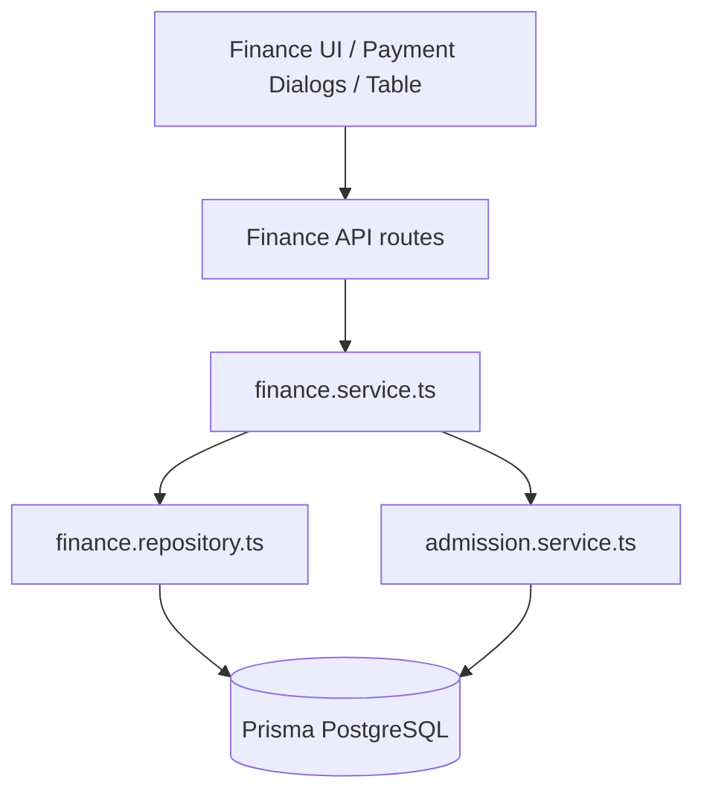
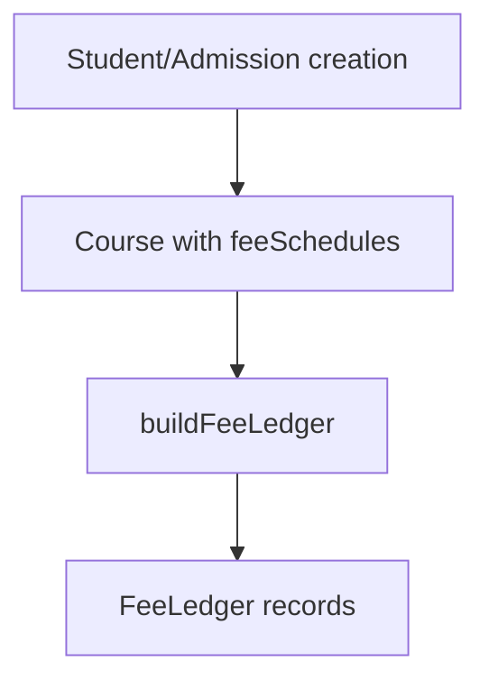
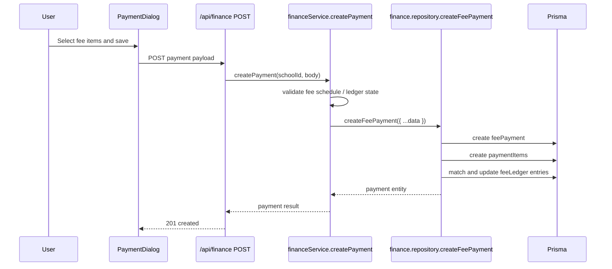
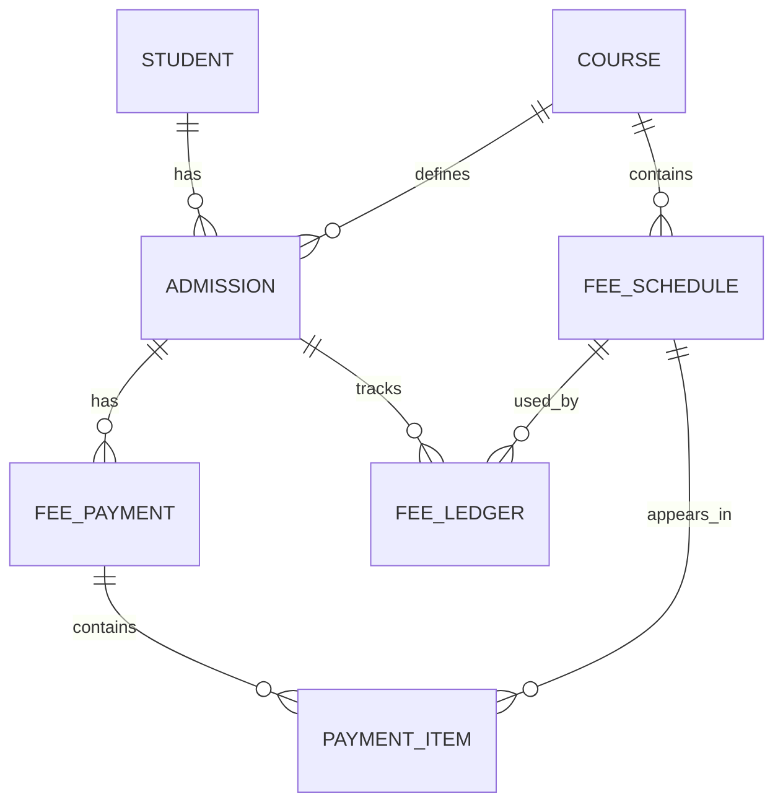
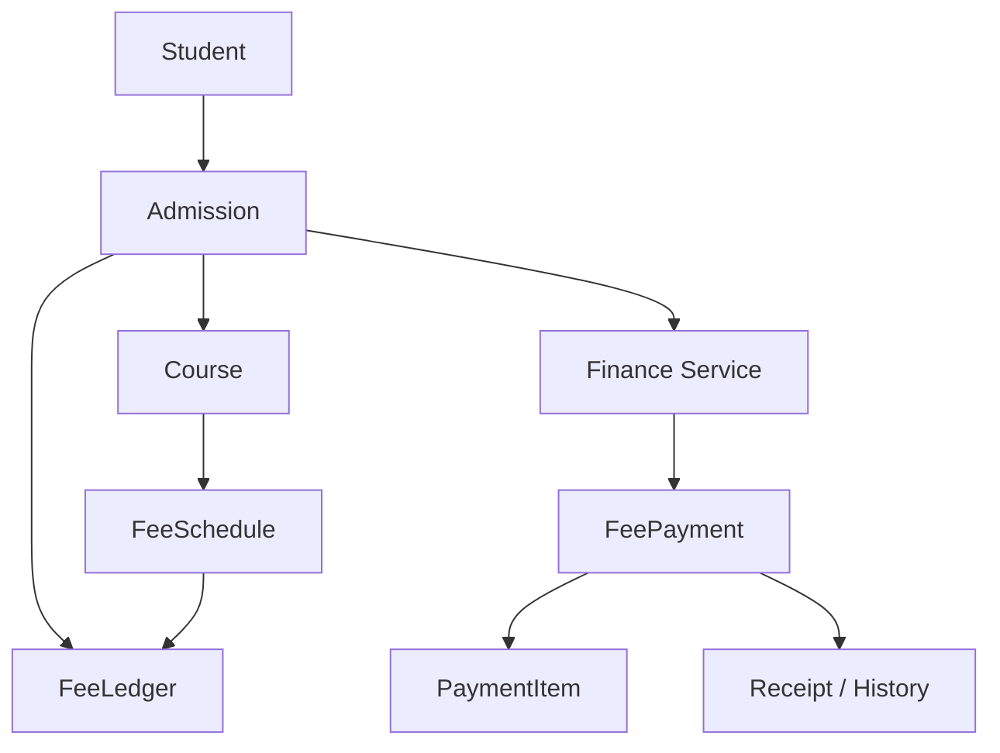

# Finance Module Architecture

## 1. Purpose and Scope

The current Finance domain in this project handles:

- payment collection
- payment list/search
- payment validation
- historical payment records
- payment item aggregation
- fee-ledger state updates
- receipt generation / receipt formatting
- finance dashboard stats

The Finance domain is implemented across:

- route-level UI under `src/app/(dashboard)/finance` and `src/components/finance`
- API routes in `src/app/api/finance`
- service layer in `src/modules/finance/services`
- repository layer in `src/modules/finance/services/repository`
- database via Prisma models in `prisma/schema.prisma`

### Confirmed financial objects

- `FeeSchedule`
- `FeeLedger`
- `FeePayment`
- `PaymentItem`
- `Admission`
- `Student`
- `Course`

### Important distinction in current implementation

The code treats finance as two separate concerns:

1. `FeeLedger` = admission-specific financial obligation snapshot
2. `FeePayment` + `PaymentItem` = historical transaction records

The code does not treat these as the same object.

### Not confirmed from current codebase

- a full separate finance module boundary outside the existing service/repository pattern
- an abstracted finance domain model beyond Prisma models and service functions
- a dedicated “finance-only” authorization layer beyond the authenticated school-scoped request flow

---

## 2. High-Level Finance Architecture



### Current execution path

```text
Finance UI
  -> /api/finance GET/POST
  -> financeService.createPayment / getFeePayments
  -> financeRepository.*
  -> Prisma feePayment, paymentItem, feeLedger updates
  -> admission fee state is validated against fee ledger expectations
```

---

## 3. Finance Modules

| Module | Location | Responsibility | Type |
| --- | --- | --- | --- |
| Finance page | `src/app/(dashboard)/finance/page.tsx` or related dashboard flow | Finance dashboard UI | Frontend route |
| Finance components | `src/components/finance/**` | Payment table, dialogs, headers, receipt preview | Frontend |
| Finance API | `src/app/api/finance/route.ts` | GET/POST payments | API route |
| Payment receipt API | `src/app/api/finance/[paymentId]/receipt/route.ts` | Receipt HTML generation | API route |
| Finance service | `src/modules/finance/services/finance.service.ts` | Business rules for payment creation/validation | Backend service |
| Finance repository | `src/modules/finance/services/repository/finance.repository.ts` | Prisma access for payment data | Backend repository |
| Finance schema | `src/modules/finance/services/finance.schema.ts` | Validation for create/update payment input | Backend validation |
| Finance types | `src/modules/finance/services/types.ts` | Shared fee ledger and search result types | Backend/shared |
| Finance server adapter | `src/modules/finance/services/server.ts` | Parses request inputs and delegates to finance service | Backend adapter |
| Admission ledger builder | `src/modules/admission/admission.service.ts` | Defines expected fee ledger entries | Backend service |
| Repair tool | `scripts/repair-fee-ledger.ts` | Ledger repair helper | Script |

### Confirmed consumers

- `FinancePage.tsx` loads payment data via `/api/finance`
- payment dialogs create payment requests
- payment receipt route reads `getPaymentReceipt`
- fee ledger validation happens before a payment is created

---

## 4. Finance Submodules

```text
Finance
├── Payment collection
├── Payment history / listing
├── Fee Ledger validation
├── Fee Schedule matching
├── Payment item records
├── Receipt generation
├── Finance dashboard summary
└── Repair / recovery helper
```

### Payment collection
- UI: `src/components/finance/dialogs/PaymentDialog.tsx`
- backend API: `src/app/api/finance/route.ts`
- service: `src/modules/finance/services/finance.service.ts` -> `createPayment`

### Payment history and listing
- repository: `getFeePayments`
- API: `GET /api/finance`
- UI: `src/components/finance/FinancePage.tsx`

### Fee ledger validation
- `buildFeeLedger` and `getMissingFeeLedgerEntries` in `src/modules/admission/admission.service.ts`
- `finance.service.ts` explicitly rejects incomplete financial state before payment creation

### Receipt generation
- `src/app/api/finance/[paymentId]/receipt/route.ts`
- `src/modules/finance/services/finance.service.ts` -> `getPaymentReceipt`
- Returns HTML receipt output for A4 / thermal formats

### Repair helper
- `scripts/repair-fee-ledger.ts`
- calls `ensureFeeLedger` against an admission to repair fee-ledger state

---

## 5. Finance Functions

### Primary exported functions

| Function | File | Responsibility |
| --- | --- | --- |
| `getFeePayments` | `src/modules/finance/services/finance.service.ts` | Query finance payment lists |
| `createPayment` | `src/modules/finance/services/finance.service.ts` | Create payment with validation |
| `updateFeePayment` | `src/modules/finance/services/finance.service.ts` | Update payment record |
| `deleteFeePayment` | `src/modules/finance/services/finance.service.ts` | Delete payment record |
| `getPaymentById` | `src/modules/finance/services/finance.service.ts` | Fetch single payment |
| `getPaymentHistory` | `src/modules/finance/services/finance.service.ts` | Load payment history for specific admission |
| `getPaymentReceipt` | `src/modules/finance/services/finance.service.ts` | Retrieve receipt payload |
| `getFeePayments` (server adapter) | `src/modules/finance/services/server.ts` | Validate and delegate list query |
| `createPayment` (server adapter) | `src/modules/finance/services/server.ts` | Parse payment body and delegate |
| `getFeePayments` (repository) | `src/modules/finance/services/repository/finance.repository.ts` | DB query for payment list |
| `createFeePayment` | `src/modules/finance/services/repository/finance.repository.ts` | DB transaction to create payment and update ledger |
| `getAdmissionPaymentContext` | `src/modules/finance/services/repository/finance.repository.ts` | Retrieves payment context for validation |
| `buildFeeLedger` | `src/modules/admission/admission.service.ts` | Builds expected ledger entries |
| `getMissingFeeLedgerEntries` | `src/modules/admission/admission.service.ts` | Finds ledger gaps |
| `ensureFeeLedger` | `src/modules/admission/admission.service.ts` | Repairs missing ledger entries |

### API handlers

| Route | File | Function |
| --- | --- | --- |
| `GET /api/finance` | `src/app/api/finance/route.ts` | fetch list of payments |
| `POST /api/finance` | `src/app/api/finance/route.ts` | create payment |
| `GET /api/finance/[paymentId]/receipt` | `src/app/api/finance/[paymentId]/receipt/route.ts` | print receipt |
| `GET /api/finance/payments/history/[admissionId]` | `src/app/api/finance/payments/history/[admissionId]/route.ts` | payment history for admission |

### Frontend finance UI

- `src/components/finance/FinancePage.tsx`
- `src/components/finance/dialogs/PaymentDialog.tsx`
- `src/components/finance/payment/FeeSchedule.tsx`
- `src/components/finance/payment/StudentPaymentCard.tsx`
- `src/components/finance/payment/PaymentSummary.tsx`
- `src/components/finance/receipt/*`

---

## 6. Supporting Functions

### Validation

Validation is handled in `src/modules/finance/services/finance.schema.ts` with Zod.

Key validation rules:

- `admissionId` must be UUID
- `receiptDate` coerces to Date
- `amountPaid` must be positive
- `paymentMethod` must be one of enum values
- `paymentItems` must be non-empty array
- each `paymentItem` requires `feeScheduleId`, `title`, and `amount`

### Ledger and payment matching

Before a payment is created, `createPayment` does this:

1. loads the admission payment context
2. builds expected ledger entries using `buildFeeLedger`
3. compares them with the existing `admission.feeLedger`
4. refuses to proceed if financial state is incomplete
5. matches each selected payment item to a ledger entry using:
   - `feeScheduleId`
   - `title`

If any selected item cannot be matched, it throws `INVALID_PAYMENT_ITEMS_MESSAGE`.

### Amount validation

The service also validates:

```text
calculatedTotal === data.amountPaid
```

If totals differ, it throws:

`Amount paid does not match selected fee items.`

### DB write pattern

The repository `createFeePayment` uses `prisma.$transaction` and does:

1. `tx.feePayment.create`
2. nested `paymentItems.create`
3. loop through payment items
4. `tx.feeLedger.findFirst` with `admissionId + feeScheduleId + title`
5. `tx.feeLedger.update` to adjust `paidAmount` and `dueAmount`

This is a confirmed atomic transaction boundary in the repository.

---

## 7. Complete Finance Flows

### Admission → FeeLedger

There is a direct admission financial setup path:



This is implemented in `src/modules/admission/admission.service.ts`.

Important facts:

- Fee schedule is the master definition.
- Fee ledger is an admission-specific snapshot.
- Monthly entries reuse the same `feeScheduleId` but have unique ledger rows via different `title` and `installmentNumber` values.

### Student Creation → Admission → FeeLedger

Confirmed path:

```text
createStudent service
  -> create Student
  -> create Admission
  -> generateFeeLedger(tx, admission.id, course, admission.admissionDate)
  -> Prisma FeeLedger entries
```

This happens inside the Student creation transaction.

### Student Import → Admission → FeeLedger

The import service also creates admissions and triggers fee ledger creation as part of the import flow.

### Finance → Payment Creation



### Payment → Paid State

The code updates `FeeLedger` after payment creation:

- reads the matching ledger row by `admissionId + feeScheduleId + title`
- current `paidAmount` is summed with current payment item amount
- `dueAmount` is recalculated as `max(amount - newPaidAmount, 0)`

This is a **ledger update** path, not a direct update of a single status flag on the payment itself.

### Payment History

Repository query `getFeePayments` includes:

- `admission.student`
- `admission.course`
- `paymentItems`
- `feeSchedule`

This means payment history is assembled from `FeePayment` records and related PaymentItem/FeeSchedule records.

### Receipt

The route `src/app/api/finance/[paymentId]/receipt/route.ts` fetches the payment and builds HTML for receipt output in different formats:

- A4
- thermal58
- thermal80

It does not appear to create a separate receipt entity in the database. It renders from payment + paymentItems + admission + student data.

---

## 8. Finance ER Diagram



### Important schema facts

- `Admission` has `feePayments` and `feeLedger`
- `FeeLedger` has `admissionId`, `feeScheduleId`, `title`, `feeType`, `amount`, `paidAmount`, `dueAmount`, `status`
- `FeePayment` has `admissionId`, `amountPaid`, `receiptNumber`, `paymentMethod`, `status`
- `PaymentItem` has `paymentId`, `feeScheduleId`, `title`, `amount`
- `FeeSchedule` is the master fee definition while `FeeLedger` is per-admission financial state

---

## 9. Finance Schematic Diagram — Summary



This reflects the repository implementation and the close coupling between admissions and fee-state lifecycle.

---

## 10. Financial Data Integrity

### FeeSchedule
The `FeeSchedule` model represents the fee definition for a course, such as admission/monthly/certificate fee types. It is the master schedule and is not per-student.

### FeeLedger
The `FeeLedger` model represents the current per-admission obligation state. It stores:

- `amount`
- `paidAmount`
- `dueAmount`
- `status`
- `installmentNumber`
- `title`

It is the actual ledger used for validating financial state before payment collection.

### FeePayment
`FeePayment` is the transaction record. It stores the payment amount, method, receipt metadata, and references to one or more payment items.

### PaymentItem
`PaymentItem` is the detailed line item inside a payment. It connects to a `feeSchedule` and stores the amount for a specific ledger title.

### Receipt
Receipt is not a separate persisted transaction table in the schema read here; it is generated from the `FeePayment` + nested `PaymentItem` and related student/admission data.

### Financial obligation vs financial transaction

Current implementation distinction:

```text
Financial obligation = FeeLedger
Financial transaction = FeePayment + PaymentItem
```

This distinction is confirmed by the service and schema design.

---

## 11. Finance Validation and Business Rules

The current implementation enforces these confirmed rules:

- a payment cannot be created if the admission financial state is incomplete
- selected payment items must match actual ledger entries by `feeScheduleId` and `title`
- total selected payment amount must equal `amountPaid`
- the `FeeSchedule` for a payment item must belong to the same school/admission context
- payment request body is validated by Zod before repository call
- `PaymentStatus` is used on payment and ledger; general values include `PAID`, `PENDING`, `PARTIAL`, `FAILED`, `CANCELLED`

### Confirmed rule source

The service checks `getMissingFeeLedgerEntries` before creating the payment.

This is not just UI-level validation; it is domain-level logic in `src/modules/finance/services/finance.service.ts`.

---

## 12. Transactions and Financial Integrity

### Confirmed transaction boundaries

`createFeePayment` in `finance.repository.ts` runs in a Prisma transaction and writes:

- `FeePayment`
- `PaymentItem[]`
- `FeeLedger` updates

This is a confirmed atomic financial write path.

### Important behavior

- the payment record is created first
- payment items are created immediately after
- fee-ledger rows are then updated by matching `admissionId + feeScheduleId + title`

### If one step fails

The transaction should roll back the entire set of writes, because it is wrapped in `prisma.$transaction(...)`.

### Not confirmed from current codebase

- separate ledger reconciliation job outside the transaction
- automatic failover or retry handling for payment/ledger mismatch

---

## 13. Legacy / Repair Architecture

There is a repair script at `scripts/repair-fee-ledger.ts`.

### Purpose

It repairs or restores `FeeLedger` entries for a given admission.

### Execution flow

```text
repairAdmissionFeeLedger(admissionId)
  -> tx.admission.findUnique with course and feeSchedules included
  -> beforeCount = admission.feeLedger.length
  -> ensureFeeLedger(tx, admission.id, admission.course, admission.admissionDate)
  -> afterCount = feeLedger.count for the admission
```

### What it affects

- `FeeLedger`
- not `FeePayment`
- not `PaymentItem`

### Safety characteristics

This script is a recovery path, not a normal application flow. The repository code includes `ensureFeeLedger` to create missing ledger rows rather than re-creating or re-writing payment history.

### Confirmed script behavior

- it accepts admission IDs as CLI arguments
- it logs a result object with `admissionId`, `beforeCount`, `afterCount`, and `paymentCount`
- it is intended to be run manually, not through the app runtime

---

## 14. Known Finance Architectural Risks / Gaps

### Issue: Finance heavily depends on ledger completeness
- Location: `src/modules/finance/services/finance.service.ts`
- Current behavior: a payment is rejected if `FeeLedger` is incomplete.
- Impact: payment collection is blocked if the financial state is not synchronized.
- Evidence: `INCOMPLETE_FINANCIAL_STATE_MESSAGE` and `getMissingFeeLedgerEntries` validation.

### Issue: Payment validation is ledger-driven, not only payment-driven
- Location: `src/modules/finance/services/finance.service.ts`
- Current behavior: a payment is accepted only if selected items match the expected ledger state.
- Impact: the app depends on ledger generation being accurate before any payment can be created.
- Evidence: matching by `feeScheduleId` and `title` with strict validation.

### Issue: History is assembled from multiple related tables
- Location: `finance.repository.ts`
- Current behavior: payment history is resolved from `FeePayment` + `PaymentItem` + `FeeSchedule` + `Admission` + `Student`.
- Impact: any mismatch between these tables can affect UI reporting.
- Evidence: `include: { admission: { include: { student, course } }, paymentItems: { include: { feeSchedule } } }`.

### Issue: Receipt is generated from query data, not stored as a separate domain model
- Location: `src/app/api/finance/[paymentId]/receipt/route.ts`
- Current behavior: the receipt is rendered dynamically from payment metadata.
- Impact: receipt data is coupled to the current database query result rather than a dedicated receipt table.
- Evidence: `getReceiptHtml(receipt: any, format)` builds HTML directly from the payment record.

---

## 15. Finance Architecture Summary

The current finance architecture is driven by a strong distinction between:

```text
Admission financial obligation
  -> FeeLedger

Payment transaction history
  -> FeePayment + PaymentItem
```

The application validates financial state before allowing payment creation, and it reconciles ledger totals after a payment is saved.

```text
Admission
  -> Course / FeeSchedule
  -> FeeLedger
  -> Finance service validation
  -> FeePayment
  -> PaymentItem
  -> Receipt / Payment History
```

This is the current implementation reflected in the repository and its Prisma schema.

---

## 16. Implementation Notes

This document reflects the current repository state. Where behavior was not directly visible, it is labeled as:

`Not confirmed from current codebase.`

No source code or database files were modified while documenting this architecture.
