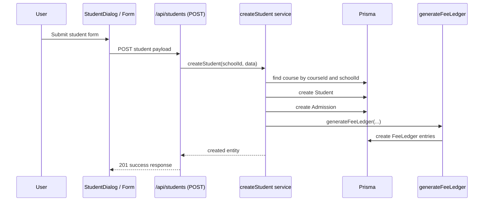
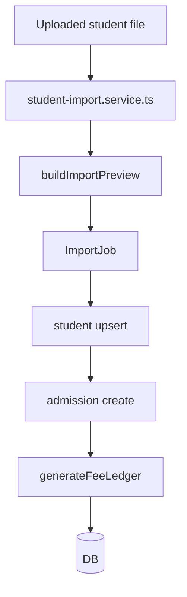
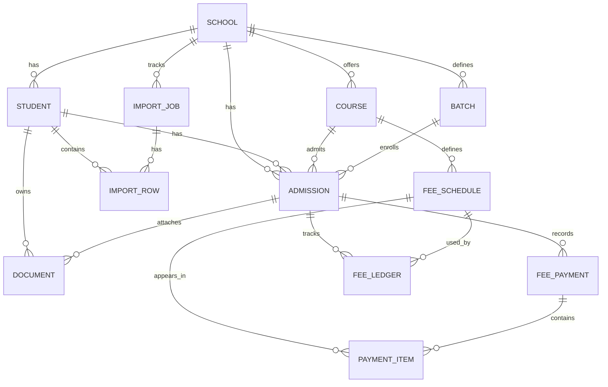

# Student Module Architecture

## 1. Purpose and Scope

The current Student domain in this repository is centered on:

- student record creation and update
- student listing and search
- student detail lookup
- student-to-admission relationships
- student import workflows
- relationship to course, batch, and fee-ledger financial state

The Student domain is implemented across:

- UI under `src/app/(dashboard)/dashboard/people/students`
- components under `src/components/students`
- service layer under `src/modules/student`
- import logic under `src/modules/import/students`
- persistence through Prisma models in `prisma/schema.prisma`

This codebase does not appear to have a separate Student repository layer. Persistence is performed directly in the service layer via `prisma` calls.

### Confirmed boundaries

- Student domain owns `Student`, `Admission`, and related import records.
- Student creation is tightly connected to `Course` selection and `FeeLedger` generation through `generateFeeLedger` in `src/modules/admission/admission.service.ts`.
- Finance-related ledger/payment artifacts are not owned by the Student module alone, but they are created as part of Student/Admission lifecycle events.

### Not confirmed from current codebase

- a dedicated student-only API route beyond the generic `/api/students` route
- an abstract repository interface for Student
- role-specific Student authorization beyond the authenticated user check used in dashboard pages

---

## 2. High-Level Architecture

```mermaid
flowchart TD
    UI[Student UI Pages / Components]
    API[/api/students route]
    SERVICE[student.service.ts]
    ADMISSION[admission.service.ts]
    DB[(Prisma PostgreSQL)]
    IMPORT[student-import.service.ts]

    UI --> SERVICE
    API --> SERVICE
    UI --> IMPORT
    SERVICE --> DB
    IMPORT --> DB
    SERVICE --> ADMISSION
    ADMISSION --> DB
```

### Current implementation path

```text
Student UI / page
  -> service function (getStudents, getStudentById, createStudent, updateStudent)
  -> prisma.student / prisma.admission / prisma.importRow
  -> course and fee schedule data
  -> fee ledger generation when a student is created or imported
```

---

## 3. Modules

| Module | Location | Responsibility | Type |
| --- | --- | --- | --- |
| Student page list | `src/app/(dashboard)/dashboard/people/students/page.tsx` | Renders student directory and fetches paginated list | Frontend route |
| Student details page | `src/app/(dashboard)/dashboard/people/students/[id]/page.tsx` | Loads one student and their admissions | Frontend route |
| Student API | `src/app/api/students/route.ts` | Lists students and creates a student | API route |
| Student service | `src/modules/student/student.service.ts` | Main business logic for student fetch/create/update/delete | Backend service |
| Student schema | `src/modules/student/student.schema.ts` | Zod validation for create student payload | Backend validation |
| Student exports | `src/modules/student/index.ts` | Re-exports service and schema | Shared module |
| Student form/dialog | `src/components/students/StudentDialog.tsx`, `StudentForm.tsx` | Client-side create/edit UI | Frontend |
| Student import | `src/modules/import/students/student-import.service.ts` | Import students from uploaded files | Backend service |
| Admission financial scaffold | `src/modules/admission/admission.service.ts` | Generates fee-ledger entries for admissions | Backend service |

### Confirmed consumers

- Student list page calls `getStudents` from `~/modules/student`.
- Student detail page calls `getStudentById` from `~/modules/student`.
- Student create dialog calls action functions under `src/modules/student/actions`.
- Student import service creates or updates student and admission records and then runs ledger generation.

---

## 4. Submodules

```text
Student
├── Student listing
├── Student detail lookup
├── Student creation
├── Student update
├── Student deletion
├── Student import
├── Student → Admission relationship
├── Admission financial state generation
└── Supporting validation and auth checks
```

### Student listing
- `src/app/(dashboard)/dashboard/people/students/page.tsx`
- `src/modules/student/student.service.ts` -> `getStudents`
- Uses `schoolId`, `page`, `pageSize`, and optional search string.
- Returns `students`, `total`, `currentPage`, `pageSize`, `totalPages`.

### Student detail lookup
- `src/app/(dashboard)/dashboard/people/students/[id]/page.tsx`
- `src/modules/student/student.service.ts` -> `getStudentById`
- Includes:
  - `admissions` with `course`, `batch`, and `feePayments`
  - `importRows`

### Student creation
- `src/app/api/students/route.ts` -> `POST`
- `src/modules/student/actions/create-student.ts`
- `src/modules/student/student.service.ts` -> `createStudent`
- Validates with `createStudentSchema` and then creates:
  1. `Student`
  2. `Admission`
  3. `FeeLedger` via `generateFeeLedger`

### Student update
- `src/modules/student/actions/update-student.ts`
- `src/modules/student/student.service.ts` -> `updateStudent`
- Updates the `Student` record only; no admission update in this function.

### Student deletion
- `src/modules/student/student.service.ts` -> `deleteStudent` and `deleteManyStudents`
- Deletes associated `feePayment`, `admission`, `importRow`, then `student`.

### Student import
- `src/modules/import/students/student-import.service.ts`
- Creates `ImportJob`, processes mapped rows, creates/updates students and admissions, and creates the fee ledger when needed.

---

## 5. Functions

### Important exported functions

| Function | File | Responsibility |
| --- | --- | --- |
| `getStudents` | `src/modules/student/student.service.ts` | Search and paginated student list |
| `getStudentById` | `src/modules/student/student.service.ts` | Fetch single student details by ID |
| `createStudent` | `src/modules/student/student.service.ts` | Create student + admission + fee ledger |
| `updateStudent` | `src/modules/student/student.service.ts` | Update student profile |
| `deleteStudent` | `src/modules/student/student.service.ts` | Delete one student and related data |
| `deleteManyStudents` | `src/modules/student/student.service.ts` | Delete multiple students |
| `createStudentSchema` | `src/modules/student/student.schema.ts` | Validation contract |
| `createStudent` (action) | `src/modules/student/actions/create-student.ts` | Revalidate page cache after create |
| `updateStudent` (action) | `src/modules/student/actions/update-student.ts` | Revalidate page cache after update |
| `importStudents` | `src/modules/import/students/student-import.service.ts` | Full import pipeline |
| `generateFeeLedger` | `src/modules/admission/admission.service.ts` | Creates ledger entries for admissions |

### Important route handlers

| Handler | File | Behavior |
| --- | --- | --- |
| `GET` | `src/app/api/students/route.ts` | Returns all students in DESC createdAt order |
| `POST` | `src/app/api/students/route.ts` | Validates request body and creates a student |
| page route | `src/app/(dashboard)/dashboard/people/students/page.tsx` | Lists students |
| dynamic route | `src/app/(dashboard)/dashboard/people/students/[id]/page.tsx` | Shows student details |

### Important frontend components

- `src/components/students/StudentDialog.tsx` — create/edit modal
- `src/components/students/StudentForm.tsx` — form input fields and submit flow
- `src/components/students/StudentTable.tsx` — list table display
- `src/components/students/StudentToolbar.tsx` — search/filter toolbar

---

## 6. Supporting Functions

### Validation and schema

Validation is primarily implemented with Zod in `src/modules/student/student.schema.ts`.

Fields covered include:

- `name` required, trimmed, 1-100 chars
- parent names optional, max length 100
- `gender` uses Prisma `Gender` enum
- `dateOfBirth` as string
- `email` validated as email or empty string
- address/city/state/pinCode optional
- `courseId` optional but required by service logic before creating an admission
- `status` uses `StudentStatus`

### Authentication / authorization

The student dashboard route uses `getAuthenticationUser` from `src/modules/auth/auth.helper.ts`.

Current behavior:

- if no auth-token cookie is present, the route returns unauthorized UI or null user handling
- the Student detail route calls `getAuthenticationUser`, then uses `user.schoolId` when calling `getStudentById`

This is a user-based school scoping check rather than a role-by-role authorization system.

### Database helper patterns

The code uses Prisma directly through `prisma` and mostly does not use a repository abstraction. Common patterns:

- `findMany`, `findUnique`, `count`, `create`, `update`, `deleteMany`, `upsert`
- `prisma.$transaction` for multi-step writes
- `schoolId` filtering throughout most record access

---

## 7. Complete Student Flows

### Student Creation



#### Files involved

- `src/components/students/StudentDialog.tsx`
- `src/components/students/StudentForm.tsx`
- `src/modules/student/actions/create-student.ts`
- `src/modules/student/student.service.ts`
- `src/modules/admission/admission.service.ts`
- `src/app/api/students/route.ts`

#### Data created

- `Student`
- `Admission`
- `FeeLedger` entries as generated by `buildFeeLedger`

#### Validation

- `createStudentSchema`
- course existence in active school course
- required student name field

#### Error handling

- `createStudent` throws `"Please select a course."` if `courseId` missing
- `course` lookup failure throws `"Selected course was not found or is inactive."`
- API catches and returns 400 with message

### Student Update

```text
User edits student profile
  -> StudentDialog
  -> updateStudent action
  -> student.service.ts -> updateStudent
  -> prisma.student.update
```

Current implementation updates the `Student` record only. Admission data is not updated in the same flow.

### Student Search

```text
Students page
  -> getStudents({ schoolId, page, search })
  -> prisma.student.findMany with OR across registrationNumber / name / fatherName / motherName / studentPhone
  -> result metadata: totalPages, currentPage
```

Search is implemented in `src/modules/student/student.service.ts`.

### Student Details

```text
Student detail page
  -> getStudentById(id)
  -> prisma.student.findUnique with admissions include
  -> includes course, batch, feePayments, importRows
  -> renders student information and admissions cards
```

### Student Import

The import flow is more advanced and uses `ImportJob` / `ImportRow` / map functions.



This import path is confirmed in `src/modules/import/students/student-import.service.ts` and not a separate route module.

### Student → Admission → Course/Batch relationship

Confirmed from Prisma schema:

- `Student` has many `Admission`
- `Admission` belongs to one `Student`
- `Admission` belongs to one `Course`
- `Admission` may belong to one `Batch` (`batchId` optional)
- Student detail page renders student admissions and each admission includes `course` and `batch`

---

## 8. Student Database / ER Diagram



### Important schema facts

- `Student` has unique constraint `[schoolId, registrationNumber]`
- `Admission` has unique constraint `[studentId, courseId, batchId]`
- `Student` uses `schoolId` as partitioning field
- `Admission` is the bridge between `Student` and `Course`
- `FeeLedger` is separate from `FeePayment` and tied to an admission

---

## 9. Student Schematic Diagram — Summary

```mermaid
flowchart TD
    UI[Student Dashboard UI]
    PAGE[Student Pages]
    API[/api/students]
    SERVICE[student.service.ts]
    ADMISSION[admission.service.ts]
    DB[(Prisma)]

    UI --> PAGE
    PAGE --> SERVICE
    API --> SERVICE
    SERVICE --> ADMISSION
    ADMISSION --> DB
    SERVICE --> DB
```

Also important:

```text
Student
  -> Admission
      -> Course
      -> Batch
      -> FeeLedger
```

---

## 10. Security and Validation

### Authentication

- dashboard pages rely on `getAuthenticationUser()` from `src/modules/auth/auth.helper.ts`
- token is read from the `auth-token` cookie and verified with `verifyToken`

### Authorization

Confirmed behavior:

- school scoping by `user.schoolId`
- access is not heavily role-split in the student service code observed here
- route-level auth is checked before loading dashboard student data

### Validation

- `createStudentSchema` in `src/modules/student/student.schema.ts`
- `createStudent` route does `createStudentSchema.parse(body)`
- `getStudents` and `getStudentById` do not apply extra Zod validation in the same way; the data is passed directly to Prisma by the service

---

## 11. Transactions and Data Integrity

### Confirmed transaction boundaries

- `createStudent` uses `prisma.$transaction` and creates:
  - `Student`
  - `Admission`
  - `FeeLedger` through `generateFeeLedger`

This means the creation sequence is atomic inside the same transaction context.

### Other integrity patterns

- `deleteStudent` and `deleteManyStudents` perform multi-step cleanup in transactions.
- `importStudents` wraps row import logic in `prisma.$transaction`.
- `Student` has a unique constraint for school + registration number.
- `Admission` has unique constraint for student + course + batch.

### Not confirmed from current codebase

- explicit soft-delete policy for students
- per-role permission enforcement beyond auth check
- complex cross-system validation beyond the schema and service logic observed

---

## 12. Known Architectural Risks / Gaps

### Issue: Student lifecycle is tightly coupled to fee ledger generation
- Location: `src/modules/student/student.service.ts`, `src/modules/admission/admission.service.ts`
- Current behavior: creating a student creates an admission and automatically creates fee ledger records.
- Why it matters: student creation is not purely a student record operation; it also triggers financial state generation.
- Impact: a defect in the fee-ledger logic can affect student creation and admission financial integrity.
- Evidence: `createStudent` calls `generateFeeLedger(tx, admission.id, course, admission.admissionDate)` immediately after admission creation.

### Issue: Student import and create flows are not fully isolated from financial logic
- Location: `src/modules/import/students/student-import.service.ts`
- Current behavior: import process upserts students and admissions, then generates fee ledger entries based on course fee schedules.
- Why it matters: import is not only a record import; it also creates financial obligations.
- Impact: import validation and data quality are connected to fee setup and course configuration.
- Evidence: the import service includes `generateFeeLedger` in the transaction flow.

### Issue: There is no dedicated Student repository abstraction
- Location: `src/modules/student`
- Current behavior: persistence is direct Prisma access from the service layer.
- Why it matters: the service layer is doing both domain logic and data access logic.
- Impact: the code is harder to isolate or substitute in tests or future refactors.
- Evidence: exported service functions call `prisma.*` directly.

---

## 13. Student Architecture Summary

The current Student architecture is a service-driven, Prisma-backed domain with tightly-coupled admission/financial state creation.

```text
UI / Page
  -> Student Service
      -> Prisma Student / Admission / ImportRow
      -> Course lookup and course-fee schedule data
      -> FeeLedger generation via Admission service
      -> Database
```

The major domain relationships are:

```text
Student
  -> Admission
      -> Course
      -> Batch
      -> FeeLedger
      -> FeePayment
```

This is the current implementation reflected in the repository, not a redesigned ideal state.

---

## 14. Implementation Notes

This document reflects the current repository state. Where behavior was not directly visible, it is labeled as:

`Not confirmed from current codebase.`

No code changes were made while documenting this architecture.
